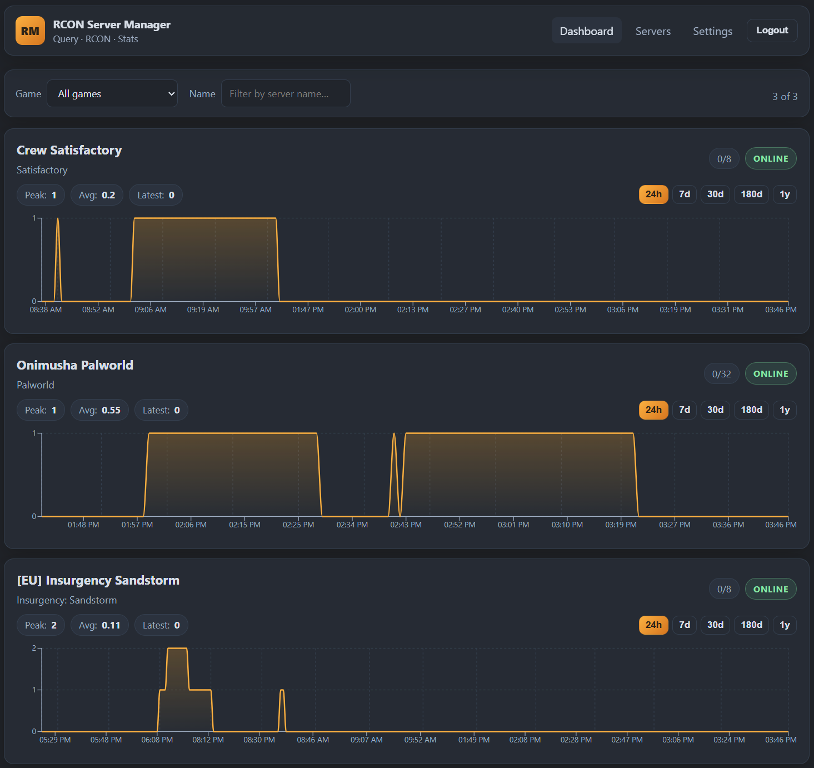

# RCON Server Manager

A self-hosted **web admin dashboard** for managing game servers from one place.

> **Note:** This project is mostly vibe-coded with [Grok](https://x.ai) and [Claude](https://claude.ai).

**Image:** [`ghcr.io/sawpsyder/rcon_server_manager`](https://github.com/SawPsyder/rcon_server_manager/pkgs/container/rcon_server_manager)  
**Source:** [SawPsyder/rcon_server_manager](https://github.com/SawPsyder/rcon_server_manager)



---

## Features

<!-- FEATURES:BEGIN -->
- Password-protected admin dashboard
- Manage multiple game servers from one UI
- Live status and automatic refresh
- Player-count history with public chart share links
- Multi-server overview
- Encrypted server credentials at rest
- Optional Steam persona name lookup
- Palworld interactive world map with share links and permanent-only bans
- Multi-user auth with invites, 2FA, mail, and server grants
- TOTP setup QR code and simpler mail test UX
- Client IP header config with Settings helpers diagnostics
- Pterodactyl panel integration for container resources and power
- Cross-chart history hover sync (span-aware across player, tick, and container load)
- Pterodactyl startup vars and Sandstorm set-default-map
- Player-weighted Sandstorm map popularity and toggle switch UI
- Admin server schedules for Pterodactyl-linked containers (power, map, RCON) with player checks and retries
- App timezone setting for schedule wall-clock times
- Global Players leaderboard and multi-account identity linking
- Dune: Awakening admin type via Sergentval egg HTTP
<!-- FEATURES:END -->

Game-specific admin tools (player control, map travel, saves, etc.) depend on the server type - see below.

---

## Supported games

### Insurgency: Sandstorm

Connects via **Source Query + RCON** (defaults: query `27131`, RCON `27015`).

- Live status and player list
- Kick, ban, and ban list management
- Admin broadcast messages
- Map / gamemode travel and quick commands
- RCON console
- Player history and playtime tracking
- Global **Players** page: overall and per-server playtime ranks for everyone ever seen
- Link multiple platform accounts (Steam / Xbox / PSN / …) as one person for ranking; dossier keeps notes and moderation history per account

### Satisfactory

Connects via the dedicated server **HTTPS API** on the game port (default `7777`). Use an admin password or API token.

- Live status and player counts (no per-player roster - the game API does not expose one)
- Player-count and tick-rate history
- Admin panel: options, advanced settings, sessions & saves, claim / rename / shutdown
- Optional certificate fingerprint pin for self-signed TLS

### Palworld

Connects via the dedicated server **REST API** (default port `8212`) - not RCON, which Pocketpair has deprecated in favour of the API. Use the server's `AdminPassword`.

- Live status, player counts, and a full player roster
- Player-count and **server FPS** history
- Kick, ban, and unban (bans are permanent - the API takes no duration)
- Admin broadcast messages
- Admin panel: interactive Palpagos world map (player + base camp markers), read-only settings, world snapshot, save, graceful shutdown, force stop
- Player history and playtime tracking, including crossplay (Steam, Xbox / Game Pass, PlayStation)

Enable the API in `PalWorldSettings.ini` (there is no launch argument for it) and restart the server:

```ini
RESTAPIEnabled=True,RESTAPIPort=8212,AdminPassword="your-password"
```

Two optional extras:

- The **World** tab (live map, actor snapshot) needs the server launched with `-enable-gamedata-api`; without it the tab explains how to turn it on.
- Palworld serves **plain HTTP** and has no TLS of its own. Pocketpair warns these endpoints "are not designed to be exposed directly to the Internet" - keep port `8212` firewalled to trusted hosts. If you front it with a TLS-terminating reverse proxy, tick **Use HTTPS** on the server and optionally pin its certificate fingerprint.

No ban list is shown for Palworld: the REST API has no endpoint for it, and bans live in `banlist.txt` on the server's disk.

### Dune: Awakening

Requires [Sergentval/pelican-egg-dune-awakening](https://github.com/Sergentval/pelican-egg-dune-awakening) with its admin UI enabled. Dune has no Source query or RCON — this manager talks to that egg's **admin HTTP** sidecar (default port `8090`). Store the egg's `DUNE_ADMIN_UI_PASSWORD`. The manager logs in, caches the 7-day Bearer token, and refreshes on 401.

Egg repository: https://github.com/Sergentval/pelican-egg-dune-awakening

- Live battlegroup status (instance count, online players, healthy maps)
- Online roster with in-game character and Steam persona (one row per FLS account)
- Kick and admin broadcast — the game has no ban command
- Admin panel: last-saved-position map + named teleport, 195-key INI settings, instance / sietch scale
- Optional HTTPS + certificate pin if a reverse proxy terminates TLS in front of the egg

Allocate the admin UI port on the egg (`DUNE_ADMIN_UI_ENABLED=1`, `DUNE_ADMIN_UI_PORT=8090`) and keep it reachable from this manager. Whole-container start/stop/restart stays on the existing Pterodactyl power controls.

---

## Quick start

Use this Docker Compose stack with **Portainer**, plain `docker compose`, or any other Compose-compatible setup. Set the variables listed under [Environment variables](#environment-variables), and change the `/change/me/...` volume paths to storage on your host. After start, open port **8080** and sign in with `ADMIN_PASSWORD`.

```yaml
services:
  db:
    image: postgres:16-alpine
    container_name: rcon-manager-db
    restart: unless-stopped
    networks:
      - rcon_manager
    environment:
      POSTGRES_USER: ${POSTGRES_USER}
      POSTGRES_PASSWORD: ${POSTGRES_PASSWORD}
      POSTGRES_DB: ${POSTGRES_DB}
    volumes:
      - /change/me/sql:/var/lib/postgresql/data
    healthcheck:
      test: ["CMD-SHELL", "pg_isready -U $$POSTGRES_USER -d $$POSTGRES_DB"]
      interval: 5s
      timeout: 5s
      retries: 12
      start_period: 10s

  rcon-manager:
    image: ghcr.io/sawpsyder/rcon_server_manager:latest
    container_name: rcon-manager
    restart: unless-stopped
    networks:
      - rcon_manager
    ports:
      - "8080:8080"
    depends_on:
      db:
        condition: service_healthy
    environment:
      ADMIN_PASSWORD: ${ADMIN_PASSWORD}
      SECRET_KEY: ${SECRET_KEY}
      DATA_DIR: /data
      SESSION_HTTPS_ONLY: ${SESSION_HTTPS_ONLY:-false}
      POSTGRES_HOST: db
      POSTGRES_PORT: "5432"
      POSTGRES_USER: ${POSTGRES_USER}
      POSTGRES_PASSWORD: ${POSTGRES_PASSWORD}
      POSTGRES_DB: ${POSTGRES_DB}
      DB_POOL_SIZE: ${DB_POOL_SIZE:-5}
      DB_MAX_OVERFLOW: ${DB_MAX_OVERFLOW:-10}
      STEAM_WEB_API_KEY: ${STEAM_WEB_API_KEY}
      # Email is configured in the app under Settings -> Email, not here
      # Optional Cloudflare Turnstile - both must be set or it stays off
      TURNSTILE_SITE_KEY: ${TURNSTILE_SITE_KEY:-}
      TURNSTILE_SECRET: ${TURNSTILE_SECRET:-}
      CLIENT_IP_HEADER: ${CLIENT_IP_HEADER:-}
    volumes:
      - /change/me/rcon_manager:/data

networks:
  rcon_manager:
```

---

## Environment variables

| Variable | Required | Description |
|----------|----------|-------------|
| `ADMIN_PASSWORD` | Yes (first boot) | Bootstrap password. Used **once**, to claim the first administrator account from the login screen. Inert afterwards — see [Users and access](#users-and-access) |
| `SECRET_KEY` | Yes | Secret used to sign session cookies |
| `POSTGRES_HOST` | Yes (Compose) | Database hostname (`db` in the sample) |
| `POSTGRES_PORT` | No | Default `5432` |
| `POSTGRES_USER` / `POSTGRES_PASSWORD` / `POSTGRES_DB` | Yes | Postgres credentials (must match the `db` service) |
| `DATA_DIR` | Recommended | App data directory inside the container (sample uses `/data`) |
| `ENCRYPTION_KEY` | No | Fernet key for encrypting stored server secrets; auto-created under `DATA_DIR` if empty |
| `SESSION_HTTPS_ONLY` | No | Set `true` when the app is only reached over HTTPS (reverse proxy) |
| `DB_POOL_SIZE` / `DB_MAX_OVERFLOW` | No | SQLAlchemy pool size (defaults `5` / `10`) |
| `STEAM_WEB_API_KEY` | No | Steam Web API key for persona name lookup |
| `DATABASE_URL` | No | Full SQLAlchemy URL; if unset, built from `POSTGRES_*` when `POSTGRES_HOST` is set |
| `RESET_TOKEN_TTL_MINUTES` / `INVITE_TOKEN_TTL_HOURS` | No | Link lifetimes (defaults `60` / `72`) |
| `TURNSTILE_SITE_KEY` / `TURNSTILE_SECRET` | No | Cloudflare Turnstile. **Both** must be set or Turnstile is not used. Gates sign-in, password-reset requests and the admin claim |
| `CLIENT_IP_HEADER` | No | HTTP header that carries the real client IP when behind a reverse proxy (e.g. `CF-Connecting-IP` for Cloudflare). Empty (default) means no proxy — use the TCP peer. Only set when clients cannot reach the app directly. Use **Settings → Helpers** to see which IP headers arrive on your requests |

---

## Users and access

Each person gets their own account. There is no shared password.

**First run.** With no administrator yet, the login screen offers *"First run? Create an
administrator"*. Enter an email, a new password, and the `ADMIN_PASSWORD` from your
environment. That creates the first admin and signs you in.

**`ADMIN_PASSWORD` is inert from that moment on.** The claim endpoint returns 404 once an
active administrator exists, and no operation is allowed to reduce the number of active
administrators to zero, so the claim window cannot be reopened from inside the app.

**Password recovery.** Every user — including administrators — recovers through the normal
password-reset flow (self-service “Forgot password” when mail is configured, or an
admin-issued reset link from **Users**). After setting a new password you always sign in
through the normal login path, including two-factor authentication when it is enabled.

**Temporary lockout.** After several failed sign-in attempts (wrong password or 2FA code)
an account is locked for a short period. The sign-in form explains the lock; administrators
see a **Temp locked** status on **Users** and can unlock the account immediately.

**Roles.**

- **Administrator** — everything, including connection settings and user management.
- **User** — only the servers an administrator grants them. On those servers they can do
  everything an admin can: RCON, kick/ban/unban, map travel, the Palworld, Satisfactory,
  and Dune: Awakening panels. They **cannot** see or edit connection settings (host,
  ports, RCON password, TLS options), and servers they were not granted are invisible —
  not merely hidden in the UI,
  but 404 from the API.

**Invitations.** Administrators invite users from **Users**. With email configured the
invitation is emailed; without it, the one-time link is shown in the UI to pass on yourself.
The same applies to password resets.

**Email is configured in the app, not in the environment** — go to **Settings → Email** and set
the SMTP host, credentials, sender, and the application URL that links are built from. It is
stored in the database (the password encrypted with the same key that protects RCON
passwords), so moving relays or rotating a password does not need a redeploy. There is a
**Send test email** button that reports the actual SMTP error rather than hiding it in the log.

Leave the SMTP host empty to turn email off entirely; invite and reset links are then shown
in the UI for you to deliver yourself. The old `SMTP_*` and `PUBLIC_BASE_URL` variables are
still read as a fallback for installs that predate this screen, and are ignored permanently
once the form has been saved once.

**Two-factor authentication** is optional and per user, set up under **Account** with any
TOTP authenticator app. Enrolment shows ten one-time recovery codes — they are displayed
once and stored only as hashes. An administrator can clear another user's 2FA if they lose
their device.

**Moderation actions are now attributed.** Kicks, bans and console commands record which
account performed them.

> **Upgrading from a single-password install:** existing session cookies are rejected on
> first start, so everyone is signed out once and the login screen shows the first-run claim.
> No data migration is needed — the schema changes are additive and admins bypass grants, so
> a single-admin install behaves exactly as before.

### Cloudflare Turnstile

Set `TURNSTILE_SITE_KEY` and `TURNSTILE_SECRET` to put a Cloudflare challenge in front of
sign-in, password-reset requests and the first-run admin claim. Leave either unset and the
feature is off entirely.

Register your deployment's hostname on the widget in the Cloudflare dashboard. For local
development use Cloudflare's always-passes test pair (site key `1x00000000000000000000AA`,
secret `1x0000000000000000000000000000000AA`), or simply leave both variables unset.

Verification always happens server-side; the browser never talks to `siteverify`. If your
deployment sits behind Cloudflare (or another reverse proxy), set `CLIENT_IP_HEADER` so the
client IP passed to Turnstile is the real visitor rather than the proxy hop. For Cloudflare
the usual value is `CF-Connecting-IP`. Leave it empty when nothing sits in front of the app.
Confirm which headers arrive under **Settings → Helpers**.

To confirm the secret reached the backend, redeem a deliberately invalid token:

```sh
curl -sS -X POST https://challenges.cloudflare.com/turnstile/v0/siteverify \
  --data-urlencode "secret=$TURNSTILE_SECRET" \
  --data-urlencode "response=XXXX.DUMMY.TOKEN.XXXX"
```

`{"success":false,"error-codes":["invalid-input-response"]}` means the secret is correct.
`invalid-input-secret` means it is not.

---

## Pterodactyl panel

If your servers run under [Pterodactyl](https://pterodactyl.io/) (or the
[Pelican](https://pelican.dev/) fork), the app can read each container's
resource usage and send power signals. Provisioning, eggs and schedules stay in
the panel — this only watches and signals.

**1. Create a Client API key.** In the panel, go to **Account Settings → API
Credentials** and create a key. It looks like `ptlc_…` (Pelican issues `pacc_…`).

> An **Application** API key from the panel's admin area will *not* work. It has
> no resource endpoint and no power endpoint, however much access it carries.
> This is the most common setup mistake.

**2. Connect.** In this app, go to **Settings → Pterodactyl**, enter the panel's
base URL (`https://panel.example.com`, no path) and the key, then press *Test
connection*. The test reports how many servers the key can see, which is the
quickest way to tell you used the right kind of key on the right account.

Leave *Verify the panel's TLS certificate* on unless the panel uses a
self-signed certificate.

**3. Link a server.** Under **Servers**, edit a server and pick its container
from the *Pterodactyl container* dropdown. Any server type can be linked.

Linked servers gain, on their detail page:

- a **Container** card — state, CPU, memory, disk, network totals and uptime
- **Start / Restart / Stop** buttons, and **Kill** for administrators
- a **Container load** chart at the same 20-second resolution

### How the numbers get there

A background poller reads every linked container **every 20 seconds**, whether
or not anyone has the page open. Both the card and the chart are views onto
what it fetched, so they cannot disagree, and history keeps accruing while
nobody is watching — which is when the outage you want to look at happens.
Nothing on a request path talks to the panel; opening ten browser tabs costs
the panel nothing.

- **Readings can be up to ~40 seconds old.** The poll interval is 20 seconds
  and the panel caches its own resource response for 20 seconds on top. The
  card shows when its reading was actually taken rather than implying it is
  live. This is also why the state pill trails a restart.
- **Power actions are asynchronous.** The panel returns "accepted" the moment
  its daemon takes the signal, so the UI says *"Restart requested"* rather than
  claiming it happened, then polls faster for a minute to catch the change.
- **Network counters reset on restart.** They are cumulative for the
  container's current lifetime, so they are shown as totals "since start"
  rather than as a transfer rate. (The counters and uptime *are* recorded, so
  deriving a rate later needs no new data — only a restart-aware diff.)
- **Rate limit.** The panel allows 256 requests/minute per key. The poller
  spends 3/min per linked server plus 0.2/min to refresh its limits, so a
  25-server panel sits around 80/min. Past roughly 55 linked servers the
  poller stretches its own interval to stay inside the budget rather than
  locking the key out, and logs when it does.
- **Storage.** Samples accrue at about 4,300 rows per day per linked server.
  The chart endpoint buckets them in SQL, so a one-year range costs the same
  to render as a one-day one, but there is no pruning yet — worth watching if
  you link a lot of servers and keep them for years.

### Who can do what

| | Admin | Granted operator |
|---|---|---|
| Configure the panel connection | ✅ | — |
| Choose which container a server links to | ✅ | — |
| See the resource card and load chart | ✅ | ✅ |
| Start / Restart / Stop | ✅ | ✅ |
| Kill (SIGKILL, no clean shutdown) | ✅ | — |

Operators can already stop a server through RCON, so withholding the way back
up would only mean waking an admin at 2am. Every power action — including one
the panel refuses — is written to the server's command history with the actor.

### Trying it without a panel

`scripts/fake_pterodactyl_panel.py` stands in for a real panel. It is stdlib
only, serves the real response shapes, reproduces the 20-second cache and the
asynchronous power transitions, and has flags for the failure modes
(`--reject-auth`, `--rate-limit`, `--wings-down`, `--suspend`, `--installing`,
`--not-a-panel`, `--slow`):

```sh
python scripts/fake_pterodactyl_panel.py --port 8099
```

Then use `http://localhost:8099` as the panel URL with any non-empty key.
